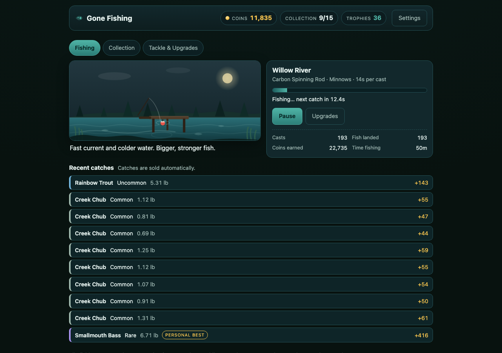

# Gone Fishing

A cozy idle fishing tycoon with optional hand fishing. Hire and assign a crew, choose tackle for
each water, take short opportunities, complete orders, chase records, and move the business to
new ponds. The game is plain HTML, CSS and JavaScript; progress stays in browser local storage.



Playtest captures: [375px dock](docs/qa-mobile.jpg) and [collection view](docs/qa-desktop.jpg).

## Run and verify

```bash
npm start           # http://127.0.0.1:8080
npm test            # deterministic engine, migration, and progression tests
npm run simulate    # six 12-hour play policies plus an active-fishing burst study
npm run build       # syntax-check and assemble dist/
```

Node 24 is used for tests and the static build. The shipped `dist/` directory has no runtime
dependencies or server API; any static host can serve it.

## The current loop

- **Six waters and thirty fish.** Stillwater Pond, Willow River and Moonlit Lake open in a run.
  Cedar Hollow, Frostwater Basin and Starlight Mere arrive through the first three prestige
  moves. Each water has its own cast pace, value, fish and conditions.
- **Tackle choices.** Bait changes size, rarity and species preferences. Rods can be switched
  after purchase: the Bamboo Pole favors large fish, Carbon works well in river current,
  Ashgrove and Frostwind specialize in their home waters, while Pro and Tideglass seek rare
  fish. Later equipment does not replace every earlier setup.
- **Rotating conditions.** Each water changes every 25 minutes. A fish's preferred bait and
  condition improve its odds; neither is a hard availability gate. The collection reveals
  preferences after discovery.
- **Crew and business.** Up to six workers have fixed specialties. Assign each a pond and bait.
  Dock expansions add berths, the stall improves sales, and training improves automatic casts.
  The Dispatch Desk refills the order board after completion; the Contract Office also accepts
  a suitable worker order while you are away.
- **Orders and opportunities.** Three offers present different objectives, including species,
  trophy, size, rarity, location, crew and optional personal catches. Every hour offers a choice
  of a 20-minute market, migration, trophy or festival bonus. Ignoring it has no penalty.
- **Hand fishing.** The three-tap reel game rewards timing with larger fish and a better sale;
  an ordinary catch remains available without timing. Active play can accelerate a contract,
  chase a rare fish, or add a short burst of income while the crew continues fishing.
- **Collection and prestige.** Each species keeps catches, best size, best sale and trophies.
  Discovering or trophy-catching all five species in a pond grants a permanent local benefit.
  Prestige asks for run earnings, workers, discoveries and trophy species. Each move awards a
  legacy point for a permanent horizontal perk in addition to the existing sale multiplier.
  Later prestige thresholds rise sharply, so a workday does not become a reset chain.

## Saves

Schema v4 migrates v1, v2 and v3 saves. Existing coins, crew, gear, catches, records, unlocked
waters and prestige count are preserved. New systems begin with default values; historical best
sale values are left at zero because they cannot be reconstructed honestly. The original save
is backed up on migration. Every prestige stores a separate pre-move backup.

The same deterministic engine processes live and offline time. Absences credit up to eight
hours once; backward clocks grant nothing. In-progress hand casts are discarded on reload.
Settings supports export, import and reset; invalid imports cannot replace the current game.
The first tab holds the write lock where the browser supports it.

## Balance notes

`tools/simulate.mjs` uses fixed RNG seeds and explicit five or fifteen minute check-ins. A
representative worker-heavy policy reaches its first paid worker around ten minutes and the
river around fifteen; a relaxed fifteen-minute policy reaches the first three prestige ponds
at roughly 1h45m, 3h00m and 4h15m. Later prestige moves take progressively longer. A
five-minute burst of 30 hand casts after one hour adds about 20% to the crew's five-minute fish
sales in the current model. These are simulated policies, not promises about every run.

The UI uses no external images, audio, tracking or in-game purchases. It supports keyboard
controls, reduced motion and a 375px mobile layout.
